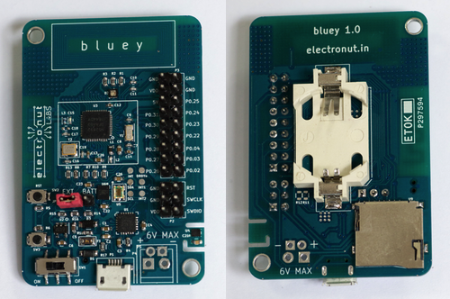

## What is Bluey?

**Bluey** is a BLE (Bluetooth Low Energy) development board with Temperature, Humidity, Ambient Light and
Accelerometer sensors.

Bluey uses the Nordic nRF52832 BLE
SoC (System on a Chip) which has an ARM Cortex-M4F CPU and a 2.4 GHz radio
that supports BLE and other proprietary wireless protocols. It also supports
NFC, and in fact the board comes with a built-in NFC PCB antenna.

### Specifications

- Nordic nRF52832 QFAA BLE SoC (512k RAM / 64k Flash)
- TI HDC1010 Temperature/Humidity sensor
- APDS-9300-020 ambient light sensor
- ST Micro LSM6DS3 accelerometer
- CREE RGB LED
- CP2104 USB interface
- 2 push buttons
- Coin cell holder
- Micro SD slot
- 2.4 GHz PCB antenna
- NFC PCB antenna

## Getting Started with Bluey

There are two main ways of uploading code into **bluey**:

1. Use the built-in OTA (over the air) bootloader which lets you upload code
using a phone.

2. Use an external programmer to upload the code. Here are a few ways of doing this:
  1. Using the Nordic nRF52-DK. [Click here](nRF52-DK-prog.md) to explore this option.
  2. Using a cheap programmer loaded with *Black Magic Probe* firmware. [Click here](blackmagic-prog.md) to read
  about this option.

## What can you do with Bluey?

You can use **bluey** for a wide range of projects. The BLE part is ideal for IoT
projects, or if you want to control something with your phone. The nRF52832 SoC
has a powerful ARM Cortex-M4F CPU, so you can use this board for any general purpose
microcontroller project as well.

With BLE and useful built-in sensors, **bluey** is a great platform for learning
IoT, BLE programming, ARM, and microcontrollers in general. In fact, it's being
currently out to use in Embedded Systems training courses.

The *code/* folder
in this repository has a bunch of interesting demo projects that we have built using
**bluey** - so do take a look!

[1]:
