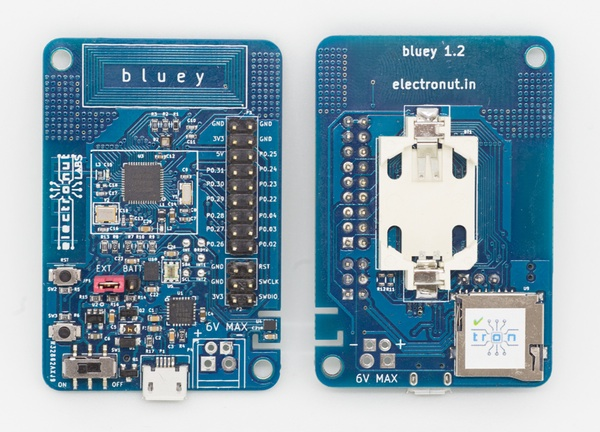
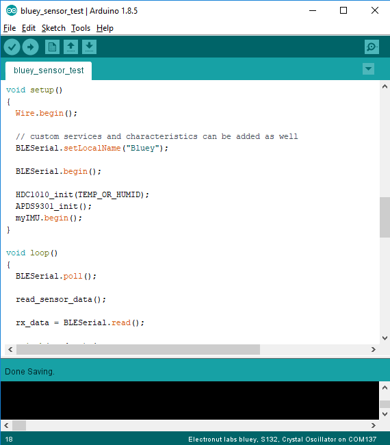
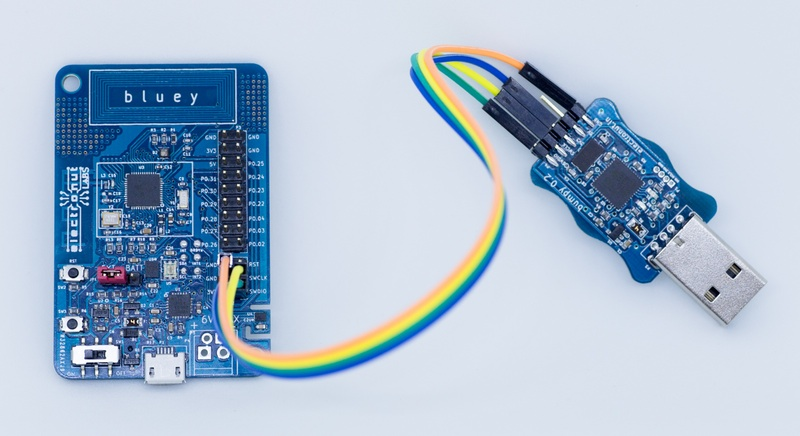

## What is Bluey?

**Bluey** is an Open Source BLE (Bluetooth Low Energy) development board with Temperature, Humidity, Ambient Light and
Accelerometer sensors.

Bluey uses the Nordic nRF52832 BLE
SoC (System on a Chip) which has an ARM Cortex-M4F CPU and a 2.4 GHz radio
that supports BLE and other proprietary wireless protocols. It also supports
NFC, and in fact the board comes with a built-in NFC PCB antenna.

### Specifications

- Nordic nRF52832 QFAA BLE SoC (512k Flash/ 64k RAM)
- TI HDC1010 Temperature/Humidity sensor
- APDS-9300-020 ambient light sensor
- ST Micro LSM6DS3 accelerometer
- CREE RGB LED
- CP2104 USB interface
- 2 push buttons
- Coin cell holder
- Micro SD slot
- 2.4 GHz PCB antenna
- NFC PCB antenna

## Getting Started with Bluey

Bluey is shipped with either Arduino bootloader or Nordic DFU-OTA bootloader as per the selection at the time of purchase. While Arduino bootloader facilitates programming Bluey using Arduino IDE via serial USB cable, Nordic's DFU-OTA bootloader allows the user to update device firmware using Nordic's software development kit (SDK) and nRF Connect mobile application over bluetooth.

We have created an [Arduino library](https://github.com/electronut/ElectronutLabs_Bluey_Arduino_Library) with example projects to help you get started quickly.

<h3><a href="#Arduino">Guide: Using Arduino</a><h3/>

<h3><a href="#Nordic OTA">Guide: Using Nordic SDK</a><h3/>

<hr />

<h2 name="Arduino"> Guide: Using Arduino </h2>



## Installation

Uploading without programmer requires bootloader programmed on the board. The repo [electronut/bluey_serial_dfu_bootloader](https://github.com/electronut/bluey_serial_dfu_bootloader/) 
contains the source and precompiled hex file of the bootloader as `hex/s132_nrf52_2.0.0_softdevice.hex`.

The bootloader has the softdevice s132 in it, so no other action is needed to use the BLEPeripheral library.

Bootloader mode is triggered by pressing and holding both prss buttons on bluey and releasing the reset button. The blue LED will start blinkng at an accelerating rate repeatedly to indicate that the bootloader mode is active.

### Board Manager

 1. [Download and install the Arduino IDE](https://www.arduino.cc/en/Main/Software) (At least v1.6.12)
 2. Start the Arduino IDE
 3. Go into Preferences
 4. Add ```https://raw.githubusercontent.com/electronut/arduino-bluey/master/docs/package_electronutlabs_boards_index.json``` as an "Additional Board Manager URL"
 5. Open the Boards Manager from the Tools -> Board menu and install "Electronut labs nRF5 Boards"
 6. Select 'Electronut labs bluey' from the Tools -> Board menu

__NOTE:__ During installation it takes the Arduino IDE a few minutes to extract the tools after they have been downloaded, please be patient.

## Uploading Bootloader

Although Bluey is shipped with the bootloader that enables programming the device using Arduino IDE, in case you erase the bootloader from Bluey, it is possible to flash it again using a [Bumpy](http://electronut.in/portfolio/bumpy/).

### Steps

1. Download [bootloader]((https://github.com/electronut/bluey_serial_dfu_bootloader/))
2. Open command prompt and access the directory containing bootloader hex file.
3. Follow steps as mentioned in the Bumpy [github](https://github.com/electronut/ElectronutLabs-bumpy) repository to connect and attach to Bluey target.
4. Issue: `load s132_nrf52_2.0.0_softdevice.hex` command. Wait for the command to execute and load the file completely.
5. Issue: `detach` command to free the target.
6. Issue: `Quit` command to close arm-gdb debugger.
7. Unplug Bumpy.
8. Connect Bluey to your PC via USB cable. You should notice the familiar blue LED blinkking at an accelerating rate, indicating Bluey is in bootloader mode.

## Usage

* After tools installation, you can now select "Electronut labs bluey" from the tools menu, and other related options. 

* Bluey comes preprogrammed with [serial DFU bootloader](https://github.com/electronut/bluey_serial_dfu_bootloader/), which Nordic's nrfjprog utility can program using serial connection. To trigger bootloader, press and hold button1, press the Reset button and then release button1.

* Bluey's blue LED will start blinking in a 'timebomb' pattern, indicating that it is in DFU bootloader mode. Now you can press upload button in arduino IDE to program your code.

* Bluey library for arduino is available at [ElectronutLabs_Bluey_Arduino_Library](https://github.com/electronut/ElectronutLabs_Bluey_Arduino_Library) repository. Download the zip file from github repository and extract the files to *Documents/Arduino/libraries* directory for Windows OS.

### Steps

* Set the device in bootloader mode. To trigger bootloader, press and hold button1 (SW3) , press the Reset button (RST) and then release button1.

* Go to: Tools > Boards. Select **Electronut labs Bluey**.

* Go to: Tools > Softdevice. Select **S132**.

* Ensure Low Frequency Clock is set to **Crystal Oscillator** under Tools menu.

* Select appropriate COM Port assigned to Bluey.

* Click on **Upload** under Sketch menu or use **Ctrl + U** combination to upload code to Bluey.

* Once code is upload, perform a manual reset by pressing **RST** button once.

## Pin mapping

```
                    Connector P3 on bluey

     A0       P0.02/AIN0   | 1   2 | P0.26        D0
     A1       P0.03/AIN1   | 3   4 | P0.27        D1
     A2       P0.04/AIN2   | 5   6 | P0.24/AIN4   A3
     D2            P0.22   | 7   8 | P0.29/AIN5   A4
     D3            P0.23   | 9  10 | P0.30/AIN6   A5
     D4            P0.24   | 11 12 | P0.31/AIN7   A6
     D5            P0.25   | 13 14 | Ex_vin
                     GND   | 15 16 | 3v3
                     GND   | 17 18 | GND


          button D6  - P0.16
              R  D7  - P0.19
              G  D8  - P0.18
              B  D9  - P0.17

      D10     SCL - P0.11    DRDYn - P0.12   D11
      D12     SDA - P0.13      INT - P0.14   D13
      D14    INT1 - P0.15     INT2 - P0.20   D15

              RXD - P0.08    TXD - P0.06
              RTS - P0.05    CTS - P0.07

              SS - P0.22    SCK - P0.25
            MISO - P0.24   MOSI - P0.23
```

* LED and button pins can be referenced by `PIN_LEDR`, `PIN_LEDG`, `PIN_LEDB` ,`LED_BUILTIN` (red one), `PIN_BUTTON` in arduino code.

## Low Frequency Clock Source (LFCLKSRC)

Bluey has an external 32 kHz crystal connected, thus, it will be used as the source for the low frequency clock. The internal 32 kHz RC oscillator can be used by removing the external crystal. The low frequency clock is used by the `delay(ms)` and `millis()` Arduino API's.

Bluey has an additional menu item under `Tools -> Low Frequency Clock` that allows you to select the low frequency clock source.

## BLEPeriphial Arduino Library

* [arduino-BLEPeripheral](https://github.com/sandeepmistry/arduino-BLEPeripheral) library can be used creating BLE applications with bluey. Follow installation steps on it's `README`. See the library's [API](https://github.com/sandeepmistry/arduino-BLEPeripheral/blob/master/API.md) for more details on usage.

* Ensure that Softdevice:"S132" is selected under tools menu. This is essential to compile BLE examples.

* _NOTE_: Although the description says "nRF8001 or nRF51822", but nRF52832 is also supported because despite changes in CPU and peripherals, the radio interface is identical in both (API is same, but there might be changes in power/sensitivity etc.)

* Once installed, you can see examples for this in examples menu. You can run most examples without modifications, unless some specify LED or button pins different from bluey's, in which case, just replace pin numbers with `LED_BUILTIN`, or `PIN_BUTTON` etc.

* Use [nRF connect](https://play.google.com/store/apps/details?id=no.nordicsemi.android.mcp&hl=en) (and other apps from nordic on play store) to scan, connect, interact with BLE peripherals created with these examples.

<hr />

<h2 name="Nordic OTA"> Guide: Using Nordic SDK </h2>

To get a project up and running with **bluey**, you need to first build the code to generate a *.hex*
file and then upload it to the board.

### Building code for Bluey

If you are just getting started with the nRF52832, we recommend that you set up and
use the Nordic nRF5 SDK for programming **bluey**. [Click here](nrf5-sdk-setup.md) to
read our *Getting Started with nRF5 SDK* guide.

### Uploading code to Bluey



There are two main ways of uploading code into **bluey**:

1. Use the built-in OTA (over the air) bootloader which lets you upload code
using a phone. [Click here](ota-prog.md) to read about this option.

2. A much more powerful option is to use an external programmer that can both
upload and debug your code. Here are a few ways of doing this:
   1. Use our inexpensive *Black Magic Probe* compatible [Bumpy SWD programmer][1]
   which was designed exactly for this purpose.
   2. Using a cheap programmer loaded with *Black Magic Probe* firmware. [Click here](blackmagic-prog.md) to learn about this option.
   3. Using the Nordic nRF52-DK. [Click here](nRF52-DK-prog.md) to explore this option.

### Powering Bluey

You can power **bluey** in several ways:

1. Using the 5V micro USB connector (which also gives you the
  option to print debug messages via UART).
2. The + / -  power supply pins which can take regular 2.54 mm header pins,
a JST connector for a 3.7 V LiPo battery, or a 3.5 mm terminal block.
3. A CR2032 coin cell for low power applications.

The sensors on bluey require a minimum of 2.7 Volts to function properly.
Please note that the *maximum power supply to bluey is 6 Volts*. Do not
exceed it! We also have reverse polarity protection on all power supplies,
but better not to tempt fate. :-)

<hr />

## What can you do with Bluey?

You can use **bluey** for a wide range of projects. The BLE part is ideal for IoT
projects, or if you want to control something with your phone. The nRF52832 SoC
has a powerful ARM Cortex-M4F CPU, so you can use this board for general purpose
microcontroller projects as well.

With BLE and useful built-in sensors, **bluey** is a great platform for learning
IoT, BLE programming, ARM, and microcontrollers in general. In fact, it's being
currently used in Embedded Systems training courses.

The [code](code/) folder
in this repository has a bunch of interesting demo projects that we have built using
**bluey** - so do take a look!

## Buy a Bluey!

Bluey is available for purchase from our [Tindie store][1]. We also provide discounts for bulk purchases. Do email us at **info@electronut.in** if you have any questions.

<a href="https://www.tindie.com/stores/ElectronutLabs/?ref=offsite_badges&utm_source=sellers_ElectronutLabs&utm_medium=badges&utm_campaign=badge_large"></a>

[1]: https://www.tindie.com/stores/ElectronutLabs/
[2]: https://www.instamojo.com/ElectronutLabs/bluey-nrf52832-ble-development-board-with-se/
