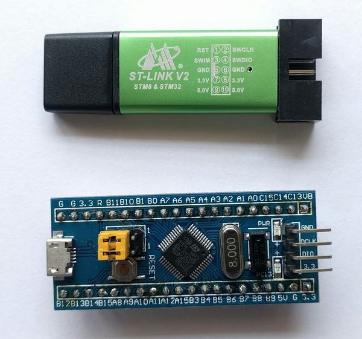

# Programming & Debugging Bluey using Black Magic Probe

The [Black Magic Probe][1]is an Open Source debugging tool for
embedded microprocessors. It greatly simplifies the debugging and code
uploading process using just GDB. Another great thing is that the firmware
for this tool can run on very inexpensive hardware. We're going to leverage this
last feature to build a cheap hardware debugger for **bluey**.

## Black Magic Probe on STM32F103 "Blue Pill"

There's a very cheap (USD 2-5) STM32F103 board commonly known as the
"blue pill". In this section, we'll upload the Black Magic Probe firmware to it,
using another cheap (USD 2) piece of hardware - an ST-Link V2 clone.

These instructions are for Windows OS.

### Preparing the hardware

Here's what you need for this task:

1. One STM32F103 "Blue Pill"
2. One cheap ST-Link V2 clone
3. [STM32 ST-Link Utility][2] from ST Microelectronics.

(Why not just use two ST-Link V2s? Well, because some of those use the STMF32F101
chip, and we need STM32F103 to ensure that Black Magic Probe firmware
works properly.)

Here's what the hardware looks like:

Now, hook them up as follows.

### Using the hardware

Ensure that the yellow jumpers on the "blue pill" are set such that BOOT0 and
BOOT1 and connected to GND.

[1]: https://github.com/blacksphere/blackmagic/wiki
[2]: http://www.st.com/en/embedded-software/stsw-link004.html
