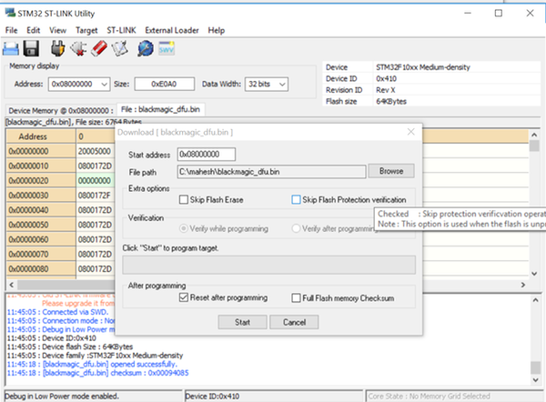
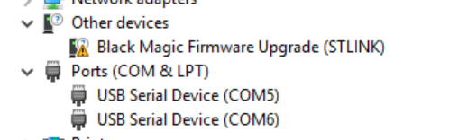
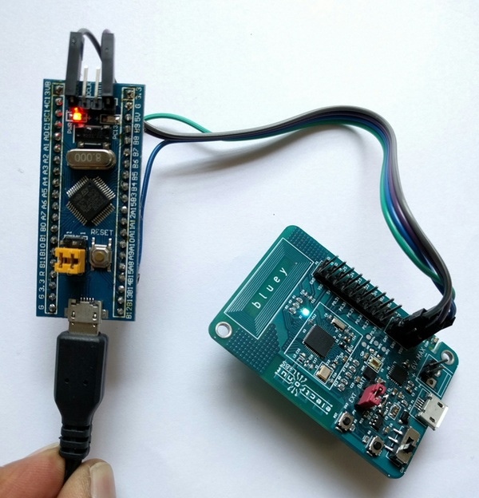

# Programming Bluey using Black Magic Probe

The [Black Magic Probe][1] is an Open Source debugging tool for
embedded microprocessors. It greatly simplifies the debugging and code
uploading process using just GDB. Another great thing is that the firmware
for this tool can run on very inexpensive hardware. We're going to leverage this
last feature to build a cheap hardware debugger for **bluey**.

## Black Magic Probe on STM32F103 "Blue Pill"

There's a very cheap (USD 2-5) STM32F103 board commonly known as the
"blue pill". In this section, we'll upload the Black Magic Probe firmware to it,
using another cheap (USD 2) piece of hardware - an ST-Link V2 clone.

These instructions are for Windows OS.

### Preparing the hardware

Here's what you need for this task:

1. One STM32F103 "Blue Pill"
2. One cheap ST-Link V2 clone
3. [STM32 ST-Link Utility][2] from ST Microelectronics.
4. GNU ARM Embedded toolchain and the Nordic nRF5 SDK. Read
our [SDk setup guide](nrf5-sdk-setup.md) for instructions.
5. Black Magic Probe firmware. [Click here][6] to read about how
to build it. (You need *blackmagic.bin* and *blackmagic_dfu.bin* built
with *make PROBE_HOST=stlink*.)

(Why not just use two ST-Link V2s? Well, because some of those use the STMF32F101
chip, and we need STM32F103 to ensure that Black Magic Probe firmware
works properly.)

Here's what the hardware looks like:


Now, hook them up as follows.

| ST-Link V2 | Blue Pill |
|----------|-------|
| 3.3 | 3.3|
| GND | GND|
| SWDIO | DIO|
| SWCLK | DCLK|

Here's what the connections look like:


Ensure that the yellow jumpers on the "blue pill" are set such that BOOT0 and
BOOT1 and connected to GND.

Now open ST-Link utility and erase the target chip (blue pill). Then program *blackmagic_dfu.bin* to the blue pill at the address *0x8000000*.



Next, program *blackmagic.bin* at the address *0x8002000* in a similar fashion.

If all went well, you'll see the following in the *Device Manager*.



Now your Black Magic Probe clone is ready to some programming.

### Using the hardware

Here, we assume that you have files *blinky.hex* and *blinky.out* in the working
directory where you start GDB. (You can generate these files yourself using the
  *peripheral/blinky/pca10040/blank* example in the Nordic SDK.)

Connect the debugger to bluey as follows:

| Debugger | bluey |
|----------|-------|
| 3.3 | VDD|
| GND | GND|
| PA5 | SWCLK|
| PB14 | SWDIO|

Here's what the hookup looks like:



Now, open a command shell and run **arm-none-eabi-gdb**:

```
C:\Users\mahesh>arm-none-eabi-gdb
GNU gdb (GNU Tools for ARM Embedded Processors 6-2017-q1-update) 7.12.1.20170215-git
Copyright (C) 2017 Free Software Foundation, Inc.
License GPLv3+: GNU GPL version 3 or later <http://gnu.org/licenses/gpl.html>
This is free software: you are free to change and redistribute it.
There is NO WARRANTY, to the extent permitted by law.  Type "show copying"
and "show warranty" for details.
This GDB was configured as "--host=i686-w64-mingw32 --target=arm-none-eabi".
Type "show configuration" for configuration details.
For bug reporting instructions, please see:
<http://www.gnu.org/software/gdb/bugs/>.
Find the GDB manual and other documentation resources online at:
<http://www.gnu.org/software/gdb/documentation/>.
For help, type "help".
Type "apropos word" to search for commands related to "word".
(gdb)
```

Now you need to connect to the target. The Black Magic Probe hardware will
create two COM ports, and you need to connect to the first one for debugging.
(You can see the ports in the *Device Manager*.)


```
(gdb) target extended-remote COM5
Remote debugging using COM5
```

Now, we scan for targets. We're using SWD here.

```
(gdb) monitor swdp_scan
Target voltage: unknown
Available Targets:
No. Att Driver
 1      Nordic nRF52
```

You can see above that it found our nRF52 target - the chip in Bluey. Now
let's connect to it.

```
(gdb) attach 1
Attaching to Remote target
warning: No executable has been specified and target does not support
determining executable automatically.  Try using the "file" command.
0x0002099e in ?? ()
(gdb)
```

Now let's upload some code to the flash memory.

```
(gdb) file blinky.hex
Reading symbols from blinky.hex...(no debugging symbols found)...done.
```

Now let's run the program.

```
(gdb) run
Starting program: C:\mahesh\nRF5_SDK_12.2.0_f012efa\examples\peripheral\blinky\pca10040\blank\armgcc\_build\blinky.hex
```
At this point you'll be able to see the LED blinking on **bluey** in various colors.

Now we're ready to do some debugging. We'll use the *.out* file this time, since that has
the necessary code symbols required for debugging.

```
(gdb) file blinky.out
A program is being debugged already.
Are you sure you want to change the file? (y or n) y
Reading symbols from blinky.out...done.
(gdb) run
The program being debugged has been started already.
Start it from the beginning? (y or n) y
Starting program: C:\mahesh\nRF5_SDK_12.2.0_f012efa\examples\peripheral\blinky\pca10040\blank\armgcc\_build\blinky.out
```

Now press Ctrl-C.

```
Program received signal SIGINT, Interrupt.
0x00001990 in nrf_delay_us (number_of_us=500000) at ../../../../../../components/drivers_nrf/delay/nrf_delay.h:128
128     __ASM volatile (
(gdb) list
123     __STATIC_INLINE void nrf_delay_us(uint32_t number_of_us)
124     {
125         const uint32_t clock16MHz = CLOCK_FREQ_16MHz;
126         if (number_of_us)
127         {
128     __ASM volatile (
129     #if ( defined(__GNUC__) && (__CORTEX_M == (0x00U) ) )
130             ".syntax unified\n"
131     #endif
132     "1:\n"
(gdb)
```

As you can see, it's showing you the code being executed. Now let's put a breakpoint in
*main.c*:

```
(gdb) break main.c:43
Breakpoint 4 at 0x1a04: file ../../../main.c, line 43.
(gdb) run
The program being debugged has been started already.
Start it from the beginning? (y or n) y
Starting program: C:\mahesh\nRF5_SDK_12.2.0_f012efa\examples\peripheral\blinky\pca10040\blank\armgcc\_build\blinky.out

Breakpoint 4, main () at ../../../main.c:43
43                  nrf_delay_ms(500);
(gdb) list
38          while (true)
39          {
40              for (int i = 0; i < LEDS_NUMBER; i++)
41              {
42                  bsp_board_led_invert(i);
43                  nrf_delay_ms(500);
44              }
45          }
46      }
47
(gdb) p i
$2 = 0
(gdb) continue
Continuing.

Breakpoint 4, main () at ../../../main.c:43
43                  nrf_delay_ms(500);
(gdb) p i
$3 = 1
(gdb)
```

As you can see above, as we loop through, we can see *i* changing. Cool huh?

If you want to learn how to use GDB I highly recommend [Art of debugging][5] by
Norman Matloff and Peter Jay Salzman.

# Loading code with Softdevice

In the above example, we used the *blinky* code which did not have a Softdevice.
Since most of our use of this chip will use BLE and hence a Nordic Softdevice, let's
take the SDK example *ble_app_hrs* and see how to load it.

First, build *ble_app_hrs* to generate the program hex file. Then use the
Nordic *mergehex* tool to combine the softdevice and program as given below.
The softdevice cam be found in *components/softdevice* folder of the SDK.

```
c:\mahesh\tmp>mergehex -m s132_nrf52_3.0.0_softdevice.hex nrf52832_xxaa.hex -o out.hex
Parsing input hex files.
Merging files.
Storing merged file.

c:\mahesh\tmp>ls -l
total 467
-rw-r--r--    1 info     Administ   130859 May  8 08:33 nrf52832_xxaa.hex
-rw-r--r--    1 info     Administ   476926 May  8 08:35 out.hex
-rw-r--r--    1 info     Administ   346118 Jul 25  2016 s132_nrf52_3.0.0_softdevice.hex
```

Now load it using our Black Magic Probe clone as shown before.

```
(gdb) load out.hex
Loading section .sec1, size 0x964 lma 0x0
Loading section .sec2, size 0xf000 lma 0x1000
Loading section .sec3, size 0xe740 lma 0x10000
Loading section .sec4, size 0x1000 lma 0x1f000
Loading section .sec5, size 0xa5a4 lma 0x20000
Start address 0x0, load size 169544
Transfer rate: 17 KB/sec, 968 bytes/write.
(gdb) run
```

And now you'll see the HRS app running happily on **bluey**!

# Using GDB in the Atom editor

[Atom][3] is gaining popularity an easy to use modern code editor. It has support for a
bewildering range of plugins, and so it has one for GDB as well - the [atom-gdb-debugger package][4].

Follow the instructions for installing the above plugin, and ensure that *arm-eabi-none-gdb* is in your PATH.

Search for "GDB Debugger" in the Atom help menu, and you'll find what you need.

The plugin is quite bare-bones and doesn't offer much more than what you get from a
command shell. But I suppose it's nice to be able to see the code and step through it from
within Atom.

[1]: https://github.com/blacksphere/blackmagic/wiki
[2]: http://www.st.com/en/embedded-software/stsw-link004.html
[3]: https://atom.io/
[4]: https://atom.io/packages/atom-gdb-debugger
[5]: https://www.nostarch.com/debugging.htm
[6]: https://github.com/blacksphere/blackmagic/wiki/Hacking
