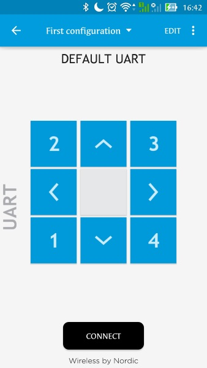
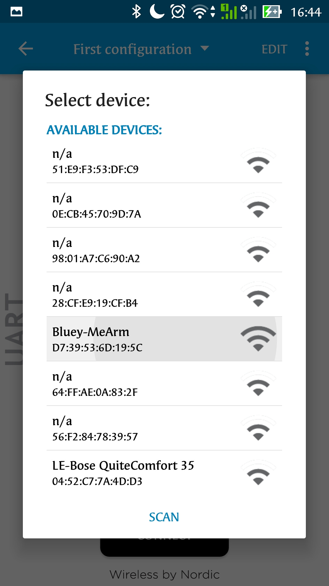
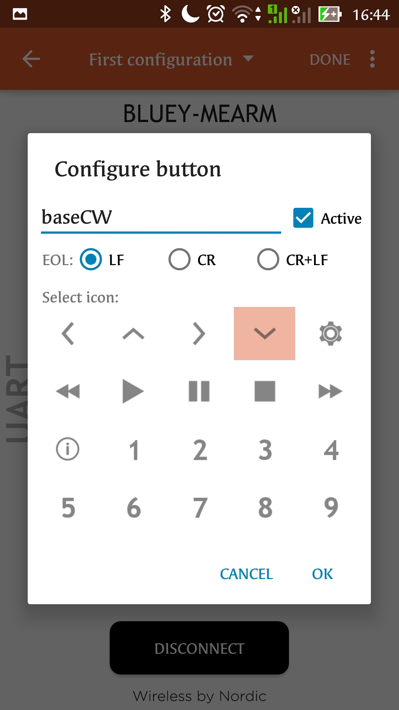

## MeArm using Bluey.

This is an example project to demonstrate the use of Bluey to control MeArm over BLE.

MeArm is a compact robotic arm with four degrees of freedom. The four degrees of freedom allow MeArm to rotate on its base, while its arm can extend horizontally and vertically and its claws can be opened and closed to grab objects. 
MeArm design files can be found [here](https://github.com/mimeindustries/MeArm) and instructions on building your MeArm can be fund [here](http://learn.mime.co.uk/docs/control-your-mearm-from-arduino/)

In our application, we use Bluey as the processing unit to control MeArm and as wireless communication unit to obtain data from a smartphone. Using nRF ToolBox, eight different states are configured - 2 states for each motor, to move the motor in two different directions; that facilitates controlling the motion of MeArm. 

#### Compiling

* Copy *bluey-MeArm* directory in *nRF5_SDK_12.2.0_f012efa\examples\ble_peripheral*.
* Open *nRF5_SDK_12.2.0_f012efa\examples\ble_peripheral\bluey-MeArm\bluey1.2\s132\armgcc* in command prompt.
* Issue `make` command to compile the program.
* Issue `dfupkg` to generate zip package. 
* The generated package is used to perform over-the-air(OTA) device firmware update (DFU). Follow instructions mentioned [here](../ota-prog.md) for detailed description on OTA programming to upload firmware to bluey.

#### Connections

Motor | Pin
----- | ---
VCC   | 5V
GND   | GND
PWM (Base Servo) | 27
PWM (Left Servo) | 28
PWM (Right Servo)| 29
PWM (Claw Servo) | 30

*Note!* Do not power the servo motors from bluey directly as the current draw of 4 servo motors is high and cannot be supported by the board. Use a dedicated power supply unit instead.

Testing:

* Power up Bluey.
* Download and Install nRF Toolbox from Play Store. Run the application.
* Select **UART** tab.
* Press on **Connect** tab to scan for devices.

* Select **Bluey-MeArm** from available devices.

* On successful connection, **Bluey-MeArm** is seen on the screen.

* Configure buttons by clicking the **Edit** tab on top-right corner of the mobile app.

* Select any button, choose an icon indicating this button and enter the value as shown in image below.

