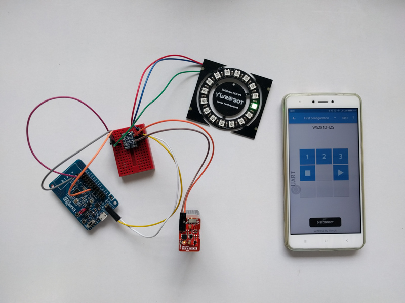

In this project, we will drive WS2812B (the improved WS2812) using the Nordic nRF52832, and control the output using a smartphone.

Read the full article here:

http://electronut.in/nrf52-i2s-ws2812/
