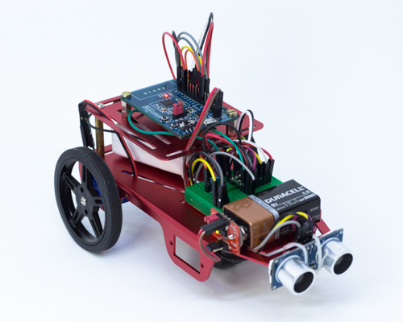
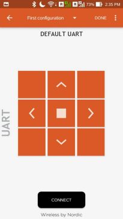
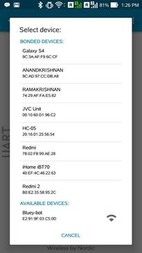

# Bluey-ultrasonic-bot 

 

###### _tested with nRF5 SDK12.2 and s132 softdevice v3.0.0_
  
The bluey-ble-ultrasonic-bot is a 2 wheeldrive with contolled and autonomous modes. When the user is connected to the bot via nRF toolbox app he can control the bot by using direction keys. But when as soon as he disconnects the bot, it goes to autonomous mode. The bot moves forward if it doesnt meet any obstacle. But if it does when the obstacle is in the range of 24cm or lesser, it stops to avoid collision. Then it turns left to avoid the obstacle and proceeds.

## Connections: 

**Bluey**| **DRV8835**| **HCSR-04**| **Motor**
-----|-------|-----|-----
5V|VCC|VCC|-
GND|GND|GND|-
pin 2|A Enable|-|-
pin 3|B Enable|-|-
pin 4|-|Trigger|-
pin 22|-|Echo|-
pin 23|B Phase|-|-
pin 24|A Phase|-|-
pin 26|Mode|-|-
-|B OUT1|-|Motor2 +
-|B OUT2|-|Motor2 -
-|A OUT1|-|Motor1 +
-|A OUT2|-|Motor1 -

## Directions to configure nRF toolbox app:

STEP 1:
Install the nRF toolbox app from playstore and open it.

STEP 2:
Now select UART option from the app.

STEP 3:
Then go to **EDIT** 

STEP 4:
Select any square and you will get a configure button settings.

STEP 5:
Select any icon you want and in "enter command" give the name as used in your code and repeat it for as much buttons you have and press "ok". 

Create 5 buttons for front, reverse, stop, left and right.

**controls**|**commands**
--------|--------
FRONT|on
RIGHT|right
LEFT|left
STOP|off
REVERSE|reverse

 

STEP 6:
Now press the "Done" option.

 
STEP 7:
Now upload the code to bluey and then press "Connect" option, and then select Bluey-bot 

STEP 8:
You are ready to control the bot. 

