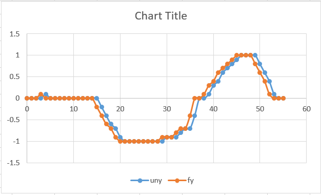
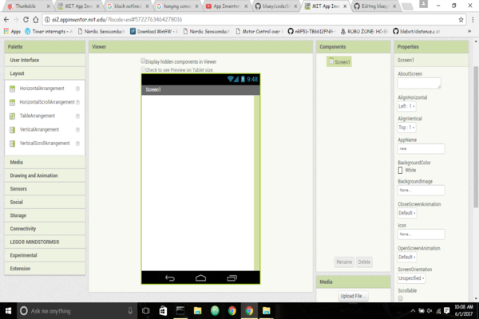
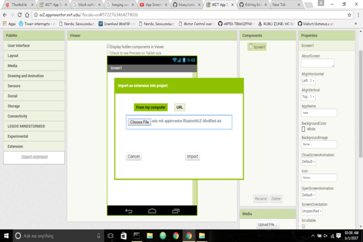
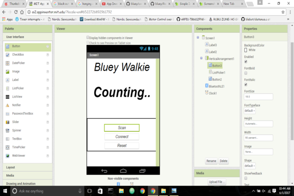
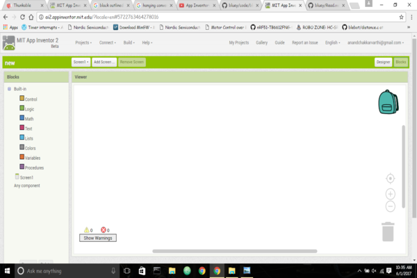
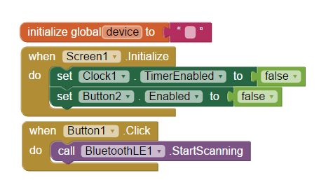
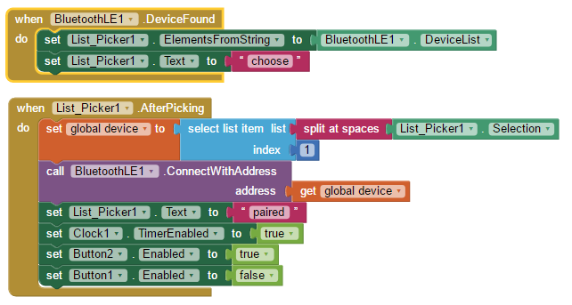
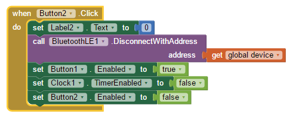
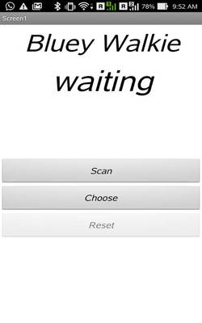

# Bluey-Walkie #

The Bluey-Walkie is an instrument for estimating the distance travelled on foot by recording the number of steps taken. The accelerometer senses the change in limb movement and its value is filtered and then calculated to find the no of steps taken. The android app is made using App inventor 2. The bluey then updates the step count to App inventor 2 via BLE. 

**BLE Extensions for App inventor-2** 
* http://appinventor.mit.edu/extensions/ - This is an official extension but doesn't supports many users.
* https://groups.google.com/forum/#!msg/mitappinventortest/xqzZuZcoZ8E/o-U1IWPuBgAJ - This is the modified of official and supports many    users

Download the files to add to the App inventor 2 and proceed with which works.

**Directions to make Bluey-Walkie**
* Upload the code to bluey so that it transmits the step count via BLE.
* Make an android app using the App inventor 2 with BLE extensions.

**Algorithm Used**
* The bluey counts the step with the help of Accelerometer. The swinging of hand/leg while walking is sensed by the change in             accelerometer value. Considering the walking cycle whenever a leg/hand goes to one extreme it is considered that a foot step is taken.   Bluey-walkie works in the same principle. 

**Filtering:**
  
  Since the device works on realtime it os subjected to noises which distrupts the calculation. Hence averaging filter is used
   
   **((n-1 + n) / 2)**
  
  The accelerometer value is stored in a variable at time n. Then at time n+1 the value is changed, hence now the previous value of the   accelerometer is averaged with the present value.   

  
   
  
  *Filtered result - Orange*
  
  *Unfiltered result - blue*
  
**Threshold Precision:**
  
  The threshold is fixed by taking a 50 samples of the filtered acceleromter data and then averaging it up to get a one sampled value.     which is then used to set the threshold. Since the count can be incresed if a hand is raised or folded too, Hence two variables are     used to check the status of the movement and provides accurate results.   

**Steps to create an android app**
 
 STEP 1: Go to http://ai2.appinventor.mit.edu and login within your mail id
 
 STEP 2: Give the name for the project and press ok.
 
 STEP 3: This is the designer window where the UI of the app is designed
 
 

 STEP 4: Inorder to establish communication between app and bluey we have to add BLE extensions.
 
 
 
 STEP 5: Select the extension pallete to your left bottom and then import extensions. A window pops as.
 
 
 
 STEP 6: Choose the folder where you have downloaded the extensions. It is recommended to use the extension which is downloaded from the          second link since the official extension given is not supporting some users
 
 
 
 STEP 7: Now press the import option. You can now able to see the extension being added as in image.
 
 
 
 STEP 8: Now from the pallete drag and drop two buttons one for scanning and one for resetting, one listpicker to show available ble              devices, a clock sensor to trigger event,a vertical arrangement to place the button and listpicker in position, one label to            display the step count.
 
 
 
STEP 9: Now to make the app work we have to arrange the blocks which you have dropped in designer tab. Now select the blocks tab at the         right top corner. 

STEP 10: Now drag and drop the blocks as of the image. When the app starts, we will disable the button named "Reset" and the timer.
         At first, the user will press the Scan button and will get a list of Bluetooth devices. 
       

STEP 11: We will use a list picker to select bluey board and connect to it. Now we will disable the "Scan" button since it has no use            now and also enabling the timer and the reset button.

STEP 12: Every second, an event will trigger the clock and our app will check the connection. If all is OK, the app will connect to the          board and will read the values from the bluey using the service and characteristic UUID.

STEP 13: A ByteValueChanged event will be triggered when our app detects a change. The new value will be assigned to the text of the              label. We will have to use the math function to divide the byte to give the step count. Since the value from the bluey is a Big          endian format.

STEP 14: This block alllows the user to reset the count and disconnect the device. Since the connection is resetted the Start button              will be enabled followed by the disabling of reset and scan.

**App's look and usage:**

This appears when you open your app

After the scan button is pressed the choose option gives you the list of available BLE devices. Connect to Bluey-Walkie

Now bluey transmits the step that you have taken which is visualised as shown

Pressing the Reset button resets and disconnects the BLE device which your are connected too

**Reference**
* http://appinventor.mit.edu/explore/blogs/karen/2016/08/heart.html
* http://www.analog.com/en/analog-dialogue/articles/pedometer-design-3-axis-digital-acceler.html

 
