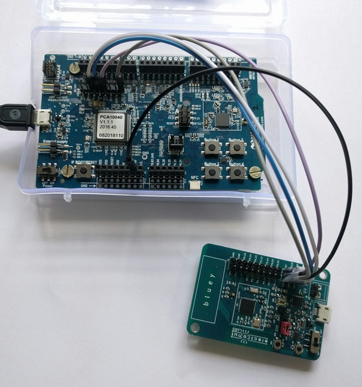

# Programming Bluey with the Nordic nRF52-DK

*Note: A similar procedure will work with the nRF51-DK as well.*

Connect the DK to Bluey as follows:

| nRF52-DK | Bluey |
|-----|----|
| VTG | VDD|
|SWDIO| SWDIO|
|SWDCLK| SWCLK|
| GND DETECT | GND|
| GND | GND|

Ensure that Bluey is powered - either via coin cell or externally.

Now, just issue *make flash_softdevice* and *make flash* commands as usual from your
command shell, and code will be uploaded by the DK on to **bluey**.
