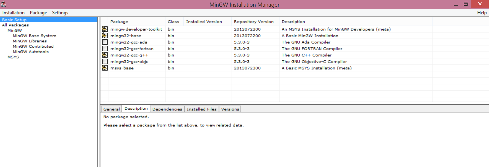
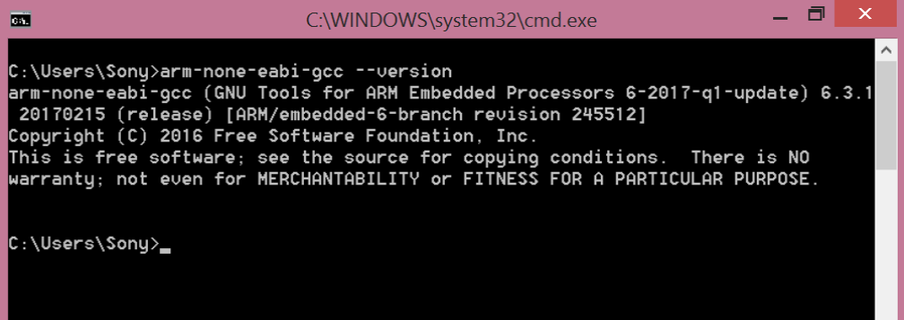
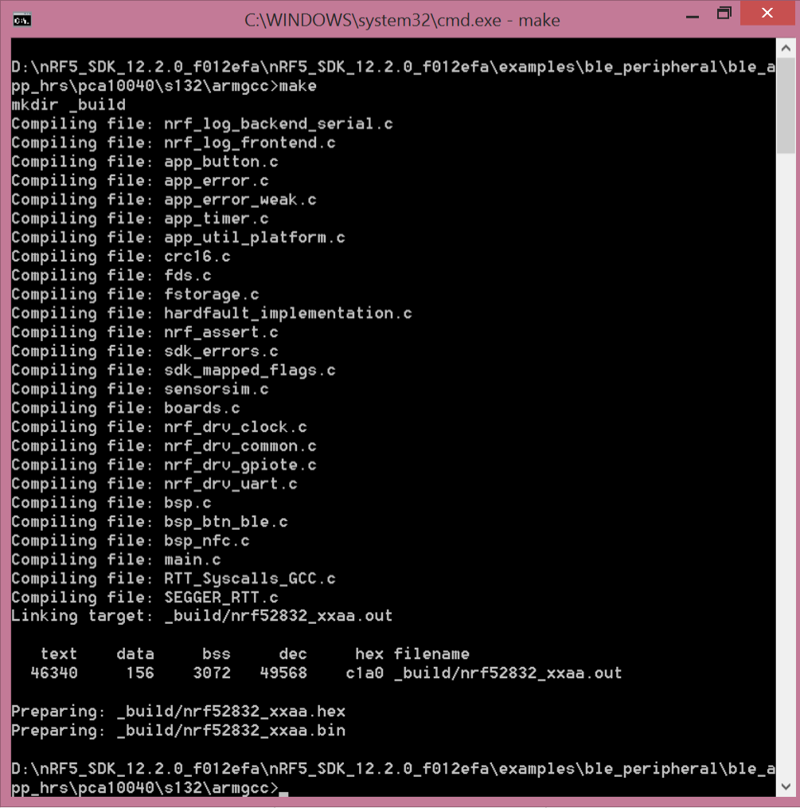
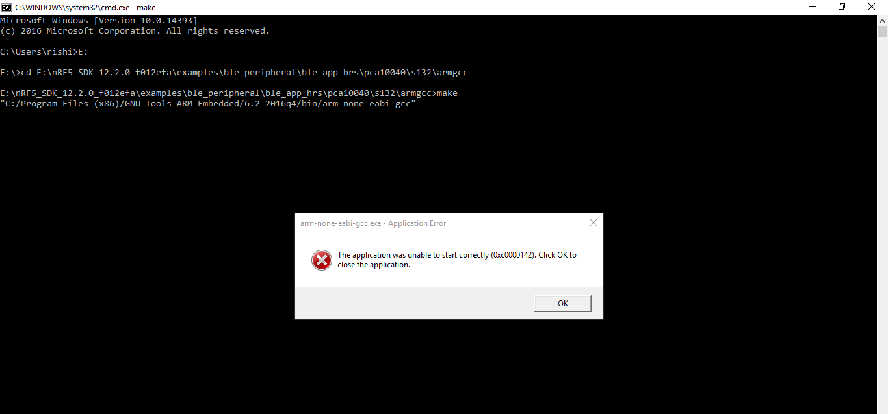

# Getting Started with Nordic nRF5 SDK

## Installation on Windows

This guide covers installation on Windows.

#### Get MinGW

* Download [MinGW](https://sourceforge.net/projects/mingw/files/) for windows for linux command line utilities.

* Run mingw-get-setup.exe

* Install at default location: C:\MinGW

* Select following packages under Basic Setup:

* Select: Installation > Apply Changes > Apply

* Add: `C:\MinGW\bin` and `C:\MinGW\msys\1.0\bin` path to environment variable separated by a semi-colon(;).

#### Get nRF SDK12.2
* Download [nRF5 SDK12.2 ](https://www.nordicsemi.com/eng/nordic/Products/nRF5-SDK/nRF5-SDK-v12-zip/54291)

* Extract: nRF5_SDK_12.2.0_f012efa.zip.

#### Get nRFGo Studio
* Download [nRFGo Studio](https://www.nordicsemi.com/chi/node_176/2.4GHz-RF/nRFgo-Studio).

* Go to: Downloads and select **nRFgo-Studio-Winxx** as per your installed Windows OS.

* Run: nrfgostudio_win-64-xxx_installer

* Install the software with "typical" configurations.

* Post installation, Install: **nRF5x-Command-Line-Tools**

#### Get ARM-GCC
* Download [GNU-ARM-GCC](https://developer.arm.com/open-source/gnu-toolchain/gnu-rm/downloads) (version 6-2016-q4) compiler.

* Run: gcc-arm-none-eabi.exe

* Check "Add path to environment variable" and click on "Finish"

#### Get Eclipse Mars 2
* Download Eclipse Mars 2 for C/C++ (32-bit) [package](http://www.eclipse.org/downloads/packages/release/Mars/2)

* Extract: eclipse-cpp-mars-2-win32.zip

* Install [GNU Arm Eclipse Plug-in](http://gnuarmeclipse.github.io/plugins/install/)

## Set up the environment to compile code

* Using Windows Explorer, open arm-gcc install directory. In my system, it is installed in `C:\Program Files (x86)\GNU Tools ARM Embedded`.

**GNU Tools ARM Embedded** includes installed ARM-GCC compilers. In this case, `6.2 2016q4`. This folder tells you the compiler version.

For exact version of currently installed ARM-GCC compiler, run:
` arm-none-eabi-gcc --version `

* Go to: `nRF5_SDK_12.2.0_f012efa\components\toolchain\gcc`

* Open Makefile.Windows in a text editor.

* Update:

`GNU_INSTALL_ROOT := C:/Program Files (x86)/GNU Tools ARM Embedded/6.2 2016q4`

and

`GNU_VERSION := 6.2.1`

* Go to: `<nRF5_Install_Directory>\examples\ble_peripheral\ble_app_hrs\pca10040\s132\armgcc`

* Issue `make` command to compile the project.

* Add `SHELL=C:/Windows/System32/cmd.exe` in Makefile.Windows if following error occurs.

## Uploading code using DFU-OTA

* Download latest release of [Python 2](https://www.python.org/downloads/)

* Install Python

* Add python to environment variables. **python.exe** can be found in `<Python2x_Install_Direc>`

* Add pip to environment variables. **pip.exe** and **pip2.exe** can be found in `<Python2x_Install_Direc>\Scripts`

* Run: `pip install nrfutil` or `pip2 install nrfutil`

* Check for updates: `pip install nrfutil --upgrade` or `pip2 install nrfutil --upgrade`

* **nrfutil.exe** can be found in `<Python2x_Install_Directory>\Scripts`. So, it is automatically included in environment variables.

* Run: `nrfutil --help` to check whether the package is installed properly.

* Using Windows Explorer, open: `nRF5_SDK_12.2.0_f012efa\examples\ble_peripheral\ble_app_hrs\pca10040\s132\armgcc`.

* In command prompt, run: `cd nRF5_SDK_12.2.0_f012efa\examples\ble_peripheral\ble_app_hrs\pca10040\s132\armgcc`

* Run: `make`, to generate hex file.

* Copy ***private.key*** file provided in the repository.

* Paste ***private.key*** file in `nRF5_SDK_12.2.0_f012efa\examples\ble_peripheral\ble_app_hrs\pca10040\s132\armgcc\_build`

* In command prompt, Run: `cd _build` to access the directory where hex file is stored.

* Run: `nrfutil pkg generate --hw-version 52 --application-version 1 --application nrf52832_xxaa.hex --sd-req 0x8C --key-file private.key app_dfu_hrs_package.zip`

_Note!: --sd-req = 0x8C for s132_nrf52_3.0.0 and --sd-req = 0x98 for s132_nrf52_4.0.2. Find complete list [here](https://github.com/NordicSemiconductor/pc-nrfutil)

* Once the zip package has been created, transfer the file to your mobile or save it to Google Drive. The file should be accessible from the smartphone.

* Connect **bluey** to the PC.

* Enter bootloader mode: Press SW3 switch followed by RST switch. Release RST switch. Once LED is red, release SW3 switch.

* Scan for bluey using nRF Connect or nRF Toolbox. The device should advertise as ***DfuTarg***

* Connect: ***DfuTarg***

* Press the **DFU** symbol.

* Select Distribution packet (ZIP) option.

* Select the package that was transferred to the smartphone earlier.

* Wait for the update to reach 100%.

* Wait for the device to disconnect.

* The device resets once the upload is complete and should advertise as ***Nordic_HRM***

