## Uploading code using DFU OTA

(These instructions are for Windows. OS X and Linux users can use *nrfutil* similarly.)

DFU stands for "Device Firmware Update" and OTA stands for "Over The Air". Bluey
comes with a bootloader which allows you to upload code over BLE.

Nordic now mandates using a secure bootloader which uses a private key to upload
firmware. In a real scenario, you would need to create and install a bootloader
in your nRF52 device that uses a private key known to you only, so that only you
can update your device. But since we are supplying you with a bootloader, we have
made this private key available to everyone. Please do not use this bootloader
in any device where you consider security to be a priority - create your own by
[following instructions][1] from Nordic Semiconductor.

Here are the steps involved in uploading your code using DFU OTA and our private key.

* Download latest release of [Python 2](https://www.python.org/downloads/)

* Install Python

* Add python to environment variables. **python.exe** can be found in `<Python2x_Install_Direc>`

* Add pip to environment variables. **pip.exe** and **pip2.exe** can be found in `<Python2x_Install_Direc>\Scripts`

* Run: `pip install nrfutil` or `pip2 install nrfutil`


* Check for updates: `pip install nrfutil --upgrade` or `pip2 install nrfutil --upgrade`

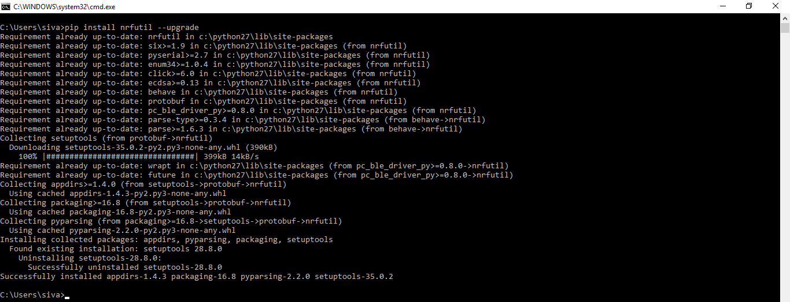

* **nrfutil.exe** can be found in `<Python2x_Install_Directory>\Scripts`. So, it is automatically included in environment variables.

* Run: `nrfutil --help` to check whether the package is installed properly.

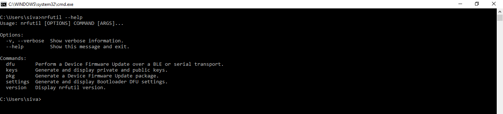

* Using Windows Explorer, open: `nRF5_SDK_12.2.0_f012efa\examples\ble_peripheral\ble_app_hrs\pca10040\s132\armgcc`.

* In command prompt, run: `cd nRF5_SDK_12.2.0_f012efa\examples\ble_peripheral\ble_app_hrs\pca10040\s132\armgcc`

* Run: `make`, to generate hex file.

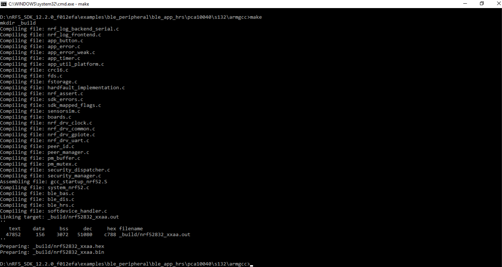

* Copy ***private.key*** file provided in the top level of this repository into the SDK
example *_build* directory. This will be similar to:  *nRF5_SDK_12.2.0_f012efa\examples\ble_peripheral\ble_app_hrs\pca10040\s132\armgcc\\_build*

* In command prompt, `cd _build` to access the directory where hex file is stored.

* Run: `nrfutil pkg generate --hw-version 52 --application-version 1 --application nrf52832_xxaa.hex --sd-req 0x8C --key-file private.key app_dfu_hrs_package.zip`

You can also automate this step by adding the following in your project's *Makefile*:

```
# make DFU package
dfupkg:
	@echo Generating DFU package...
	nrfutil pkg generate --hw-version 52 --application-version 1 --application $(OUTPUT_DIRECTORY)/nrf52832_xxaa.hex --sd-req 0x8C --key-file ../../../private.key forcesensor_dfu_package.zip
```

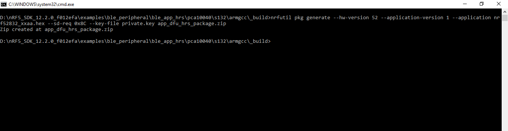

*Note:* Use *--sd-req = 0x8C* for s132_nrf52_3.0.0 and *--sd-req = 0x98* for s132_nrf52_4.0.2.
Find complete list [here](https://github.com/NordicSemiconductor/pc-nrfutil)

* Once the zip package has been created, transfer the file to your mobile or save it to Google Drive. If transferred via Google Drive, ensure that you download the file from Drive to your mobile device.

* Power **bluey** up.

* Enter bootloader mode: Press SW3 switch followed by RST switch. (Hold both down.) Now, release RST switch followed by the SW3 switch.

* Scan for bluey using nRF Connect or nRF Toolbox. The device should advertise as ***DfuTarg***

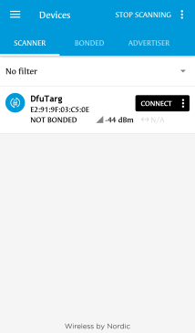

* Connect: ***DfuTarg***

* Press the **DFU** symbol.

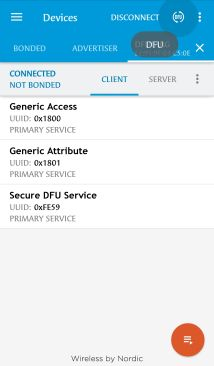

* Select Distribution packet (ZIP) option.

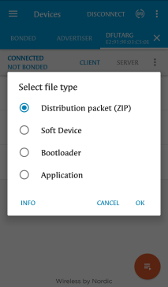

* Select the package that was transferred to the smartphone earlier.

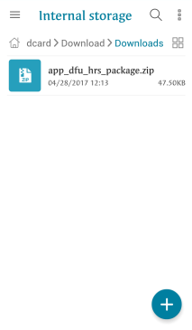

* Wait for the update to reach 100%.

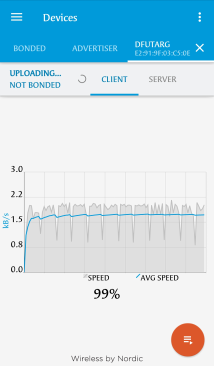

* Wait for the device to disconnect.

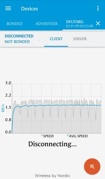

* The device resets once the upload is complete and should advertise as ***Nordic_HRM***

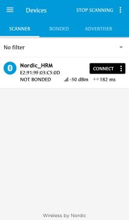

Congratulations! You have successfully uploaded code to Bluey via DFU OTA.

[1]: https://devzone.nordicsemi.com/blogs/1085/getting-started-with-nordics-secure-dfu-bootloader/
